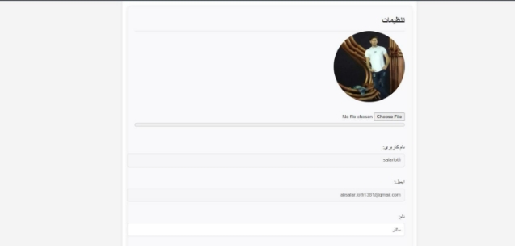
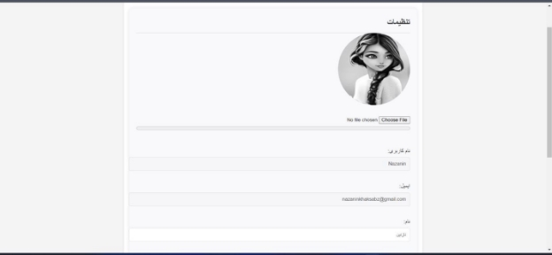
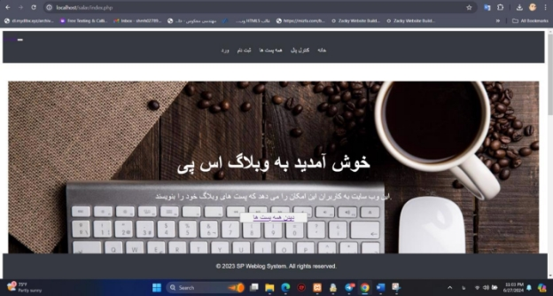
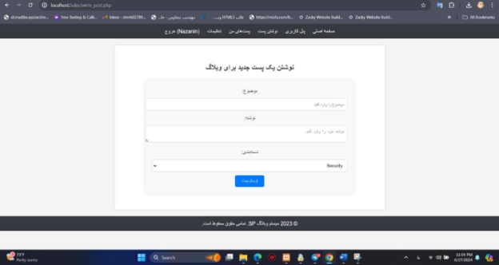
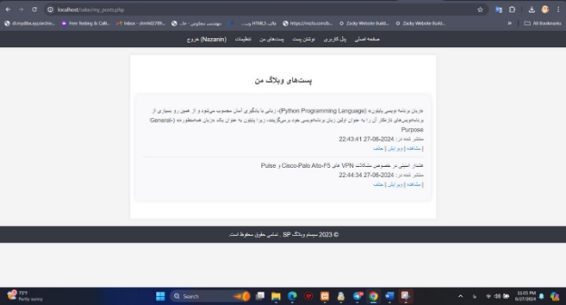
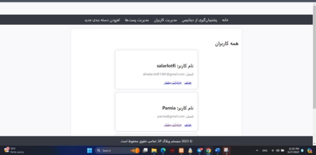
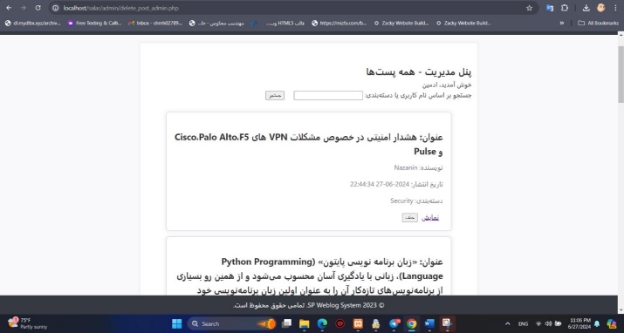

# داکیومنت ارائه پروژه وبلاگ

## 1- مقدمه

این فایل برای معرفی و توضیح پروژه وبلاگ تهیه شده است. پروژه شامل یک سیستم مدیریت وبلاگ است که به کمک PHP و MySQL پیاده‌سازی شده و قابلیت‌های مختلفی ارائه می‌دهد.

### 1.1 معرفی پروژه

- **نام پروژه**: سیستم وبلاگ SP
- **توسعه دهندگان**: سالار لطفی و نازنین خاکسبز

### 1.2 قابلیت‌ها و عملکرد پروژه

این پروژه از قابلیت‌های زیر برای کاربر برخوردار است:

- **ورود**: کاربران می‌توانند با نام کاربری و رمز عبور وارد سیستم شوند و پروفایل خود را مدیریت کنند.
- **ثبت نام**: کاربران می‌توانند با انتخاب یوزرنیم یکتا و ایمیل و رمز عبور حساب کاربری ایجاد کنند.
- **دیدن پست‌ها**: می‌توانند تمام پست‌ها را ببینند و جستجو کنند بر اساس نام، تاریخ، ساعت و نویسنده.
- **نوشتن پست**: کاربران می‌توانند با انتخاب موضوع و متن موضوع و دسته‌بندی شروع به ایجاد پست‌های مرتبط با این موضوع کنند.
- **مدیریت پست**: کاربر مورد نظر می‌تواند پست خود را نمایش دهد، ویرایش یا حذف کند.
- **تنظیمات**: می‌تواند برای خود عکس پروفایل و بیو و ... تنظیم کند.
- **تغییر رمز عبور**: می‌تواند رمز عبور خود را در تنظیمات بخش پسورد تغییر دهد.
- **فراموشی رمز عبور**: اگر رمز عبور خود را فراموش کرده باشد می‌تواند از بخش ورود نسبت به بازیابی اقدام کند.

این پروژه از قابلیت‌های زیر برای ادمین برخوردار است:

- **مدیریت کاربران**: حذف کاربران و دیدن جزئیات بیشتر.
- **مدیریت پست‌ها**: نمایش و حذف پست‌ها و جستجو بر اساس نام کاربری و دسته‌بندی.
- **مدیریت دسته‌بندی‌ها**: اضافه کردن دسته‌بندی‌ها.
- **پشتیبان‌گیری از دیتابیس**: ایجاد نسخه پشتیبان از دیتابیس برای حفاظت از اطلاعات.

### 1.3 فناوری‌های استفاده شده

- **زبان برنامه‌نویسی**: PHP
- **پایگاه داده**: MySQL
- **فریمورک رابط کاربری**: Bootstrap

### 1.4 توضیحات فنی

- **اتصال به پایگاه داده**: استفاده از MySQL برای ذخیره و بازیابی اطلاعات.
- **مدیریت جلسات**: استفاده از PHP برای مدیریت جلسات ورود کاربران به سیستم.

## 2- تصویر کلی سیستم

### تنظیمات / پروفایل





### صفحه اصلی سایت



### نوشتن پست مورد نظر / انتخاب دسته‌بندی



### پست‌های من / ویرایش / حذف / مشاهده



### مدیریت / مدیریت کاربران مخصوص ادمین / حذف / دیدن جزئیات بیشتر



### مدیریت / مشاهده پست‌های کاربران / جستجو بر اساس دسته‌بندی و نویسنده / حذف / نمایش پست



## 3- توضیحات بیشتر

این پروژه با هدف آسان‌تر کردن مدیریت یک وبلاگ طراحی شده است. از این طریق مدیر می‌تواند به راحتی پست‌ها، کاربران و دسته‌بندی‌های وبلاگ را مدیریت کند و با استفاده از ابزارهای جستجو، به سرعت به اطلاعات مورد نیاز دسترسی پیدا کند.

## 4- نکات پایانی


- این پروژه به منظور ارائه تهیه شده است و به عنوان محصول نهایی تحت وبلاگ ارائه خواهد شد و ما تا آخرین لحظه ارائه در حال گسترش پروژه هستیم تا جایی که بتوانیم 100% خود را بگذاریم.
- هرگونه سوال یا درخواست اضافی می‌تواند از طریق ایمیل [salar.lotfi1381@gmail.com](mailto:salar.lotfi1381@gmail.com) مطرح شود.
- برای تست می‌توانید اکانت ساخته و وارد شوید و پست ایجاد کنید. ولی برای دسترسی به بخش ادمین، ابتدا صفحه ip.php را بالا بیاورید و ایپی داده شده را داخل فایل access.php جایگذاری کنید تا به بخش ادمین دسترسی داشته باشید، برای مثال:

- نام دیتابیس انتخاب شده: sp_webloge

  ```txt
  http://localhost/spblog/admin
  http://localhost/spblog/ip.php
  ```

## 5- منابع


- لیست منابع
- ChatGPT
- W3Schools درباره: PHP

